# .NET nanoFramework 安装教程

## 准备材料

esp32单片机（支持wifi蓝牙） 安卓数据线（需要支持传输）

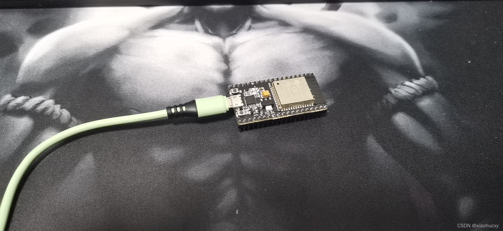

### 注意！请先安装esp32驱动程序

[ESP32驱动链接]('http://nanoframework.oss-cn-shenzhen.aliyuncs.com/MH-ET%20ESP32%E5%BC%80%E5%8F%91%E6%9D%BF%E8%B5%84%E6%96%99.zip')

### 安装 .NET nanoFramework固件闪存

安装工具

```shell
dotnet tool install -g nanoff
```

刷入固件

```shell
nanoff --platform esp32 --serialport COM3 --update
```

## 然后准备vs code, 和vs2022,本文将用vs2022做教程

准备好以后将esp32设备和电脑连接（安卓线连接）

开始搭建esp32的nanoframework 开发环境

### 安装完成以后；打开vs2022,点击继续但无需代码


### 点击管理扩展

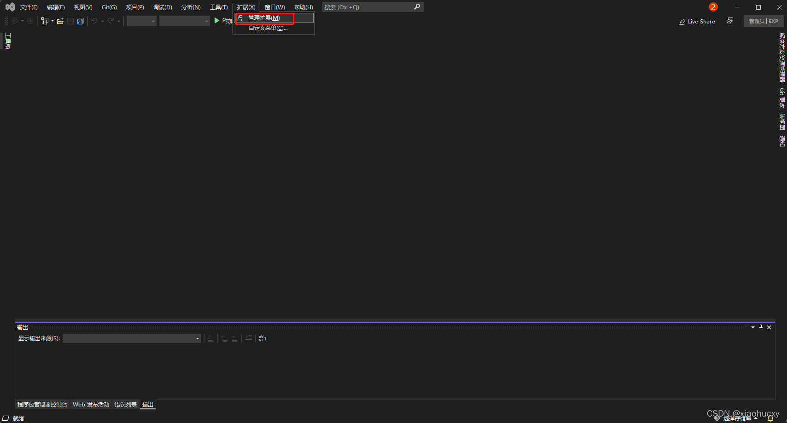

### 搜索并安装nanoframework扩展，安装完成以后关闭整个vs2022

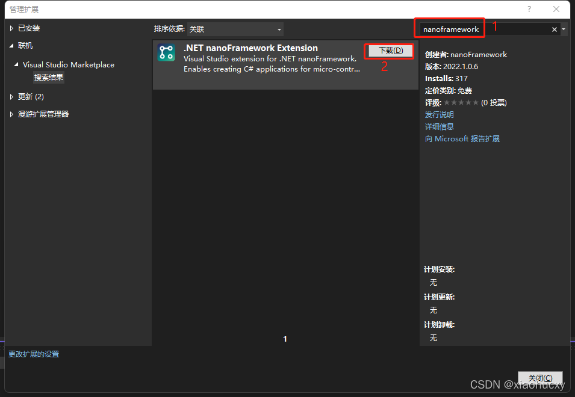

### 关闭vs2022以后后弹出这个安装扩展的界面点击安装

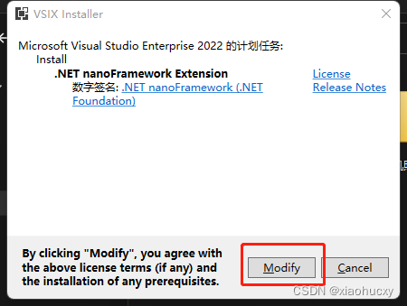

### 漫长的等待安装

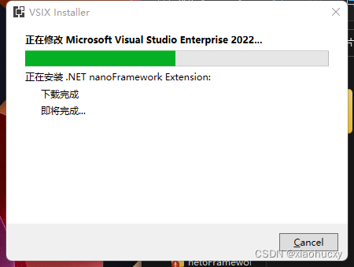

### 安装完成重新打开vs2022

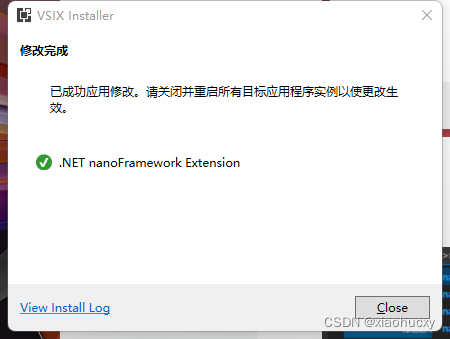

### 然后点击创建新项目

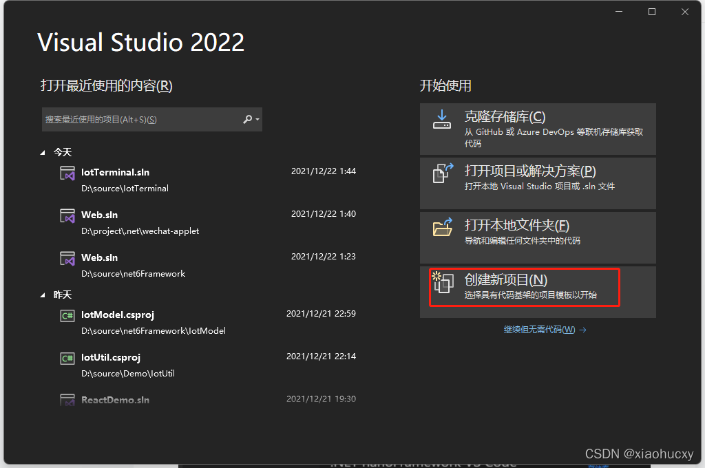

### 搜索nanoframework，然后点击第一个然后点击下一步

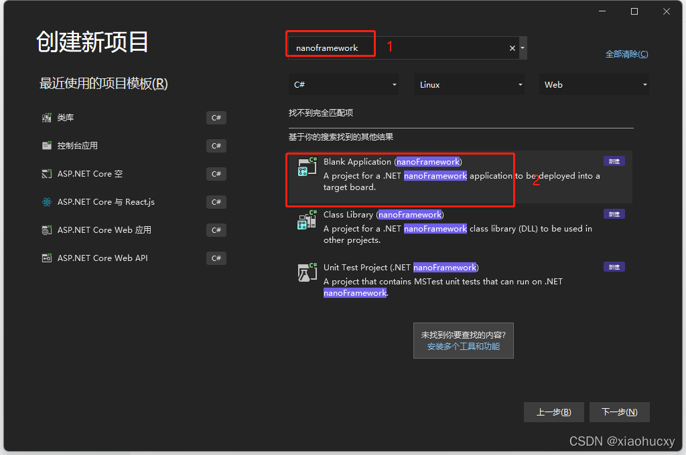

### 创建项目Demo示例点击创建

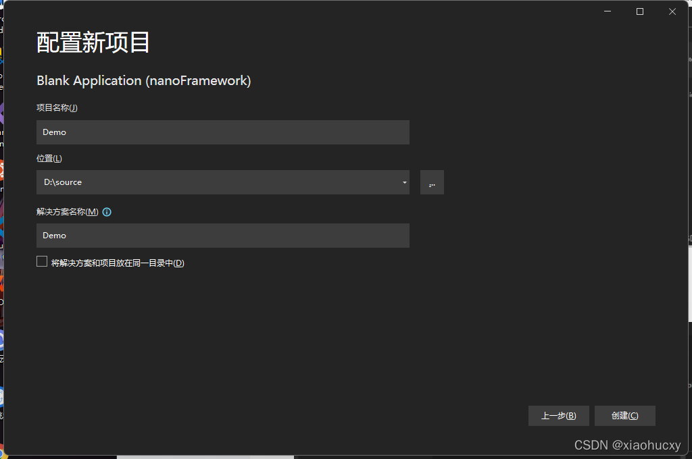

### 依次点击视图=》其他窗口=》Device Explorer

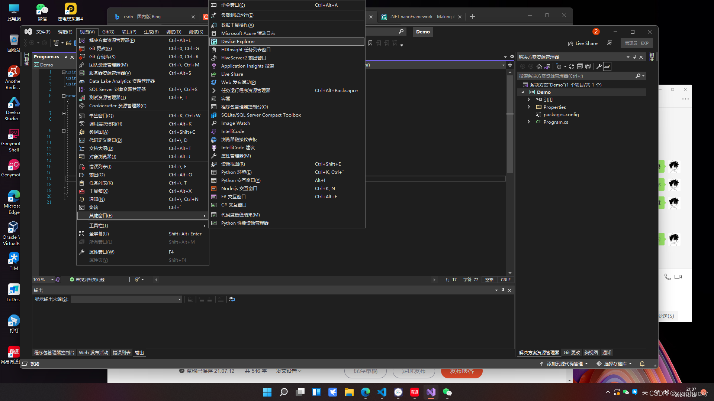

### 点击设置


### 全部点击两边全部点击（COM port black list:表示屏蔽COM）

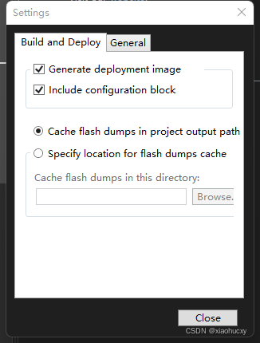
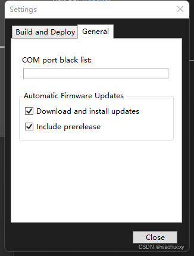

### 然后关闭设置；我们在来到vs code中找到刚刚vs2022创建的项目路径 并打开

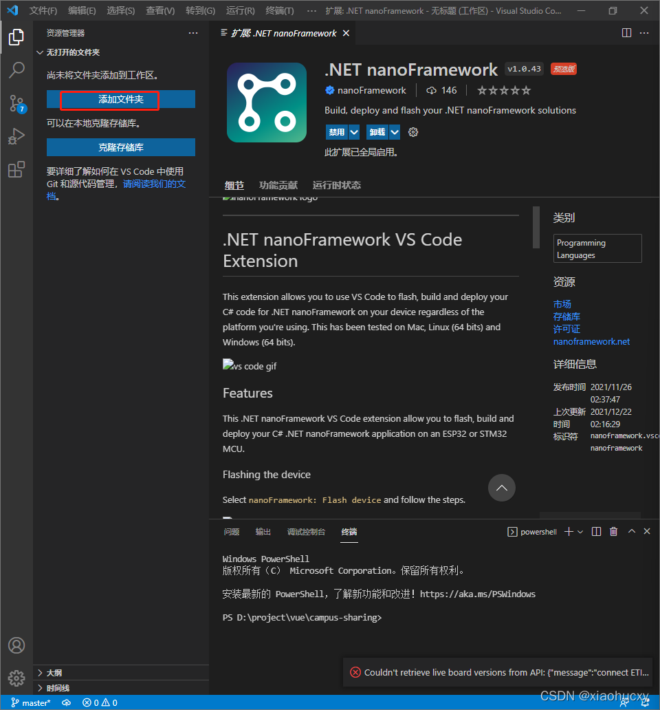


然后打开vs2022这个时候我们就可以看到设备了然后点击运行

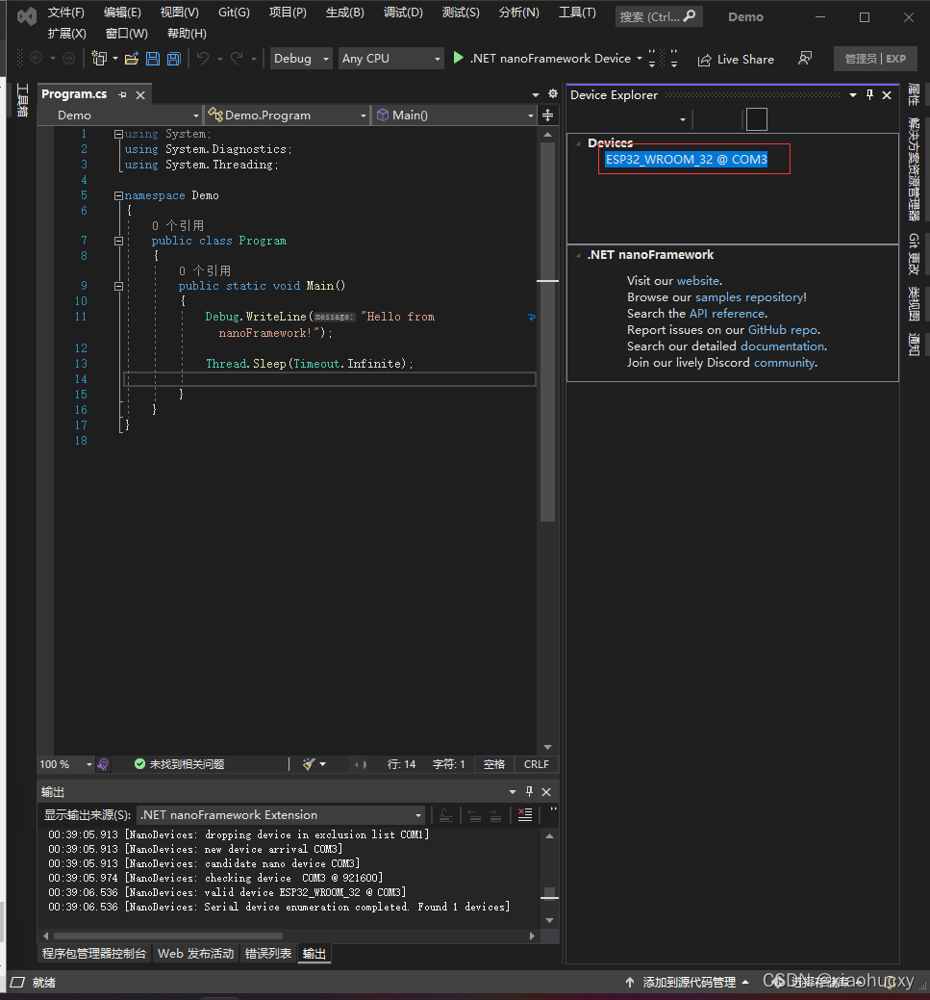

### 好了运行完成

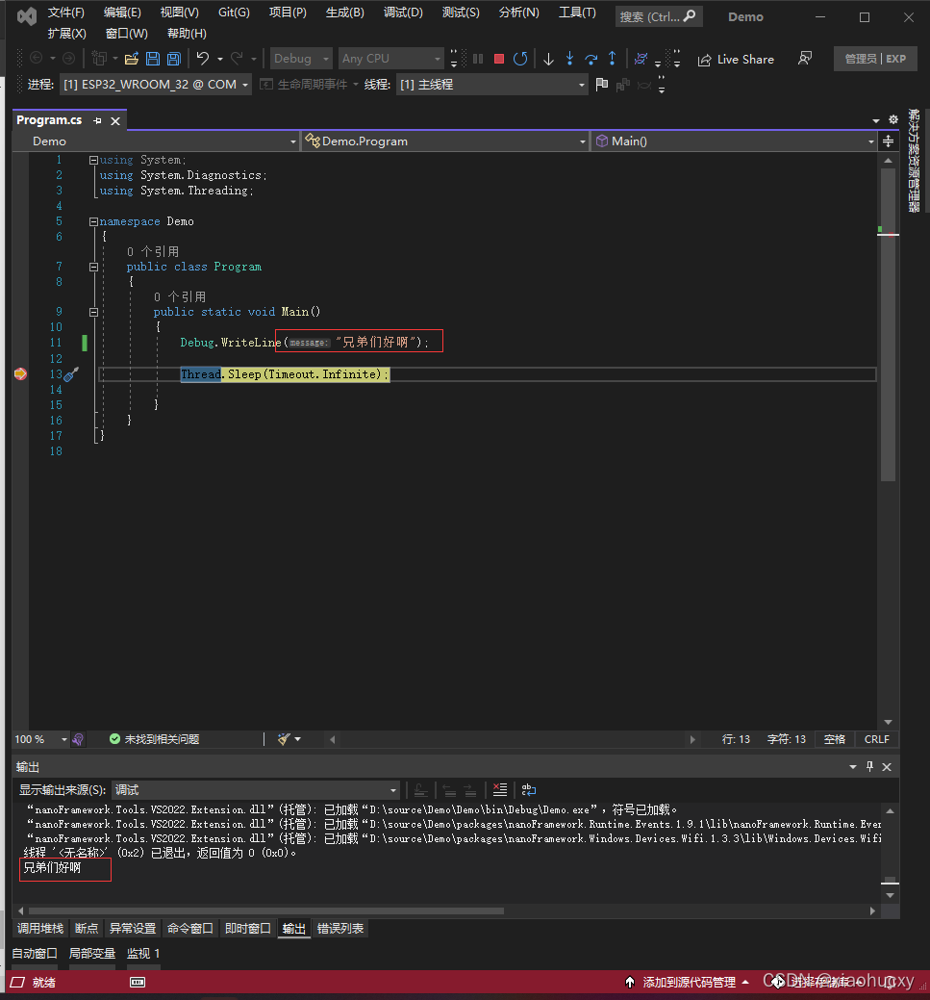

有喜欢c#单片机研究的朋友可以加我的q：239573049
