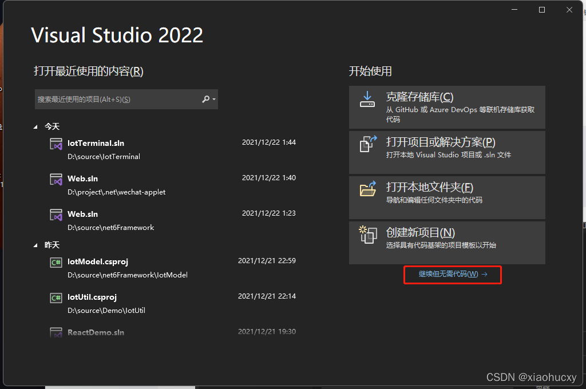
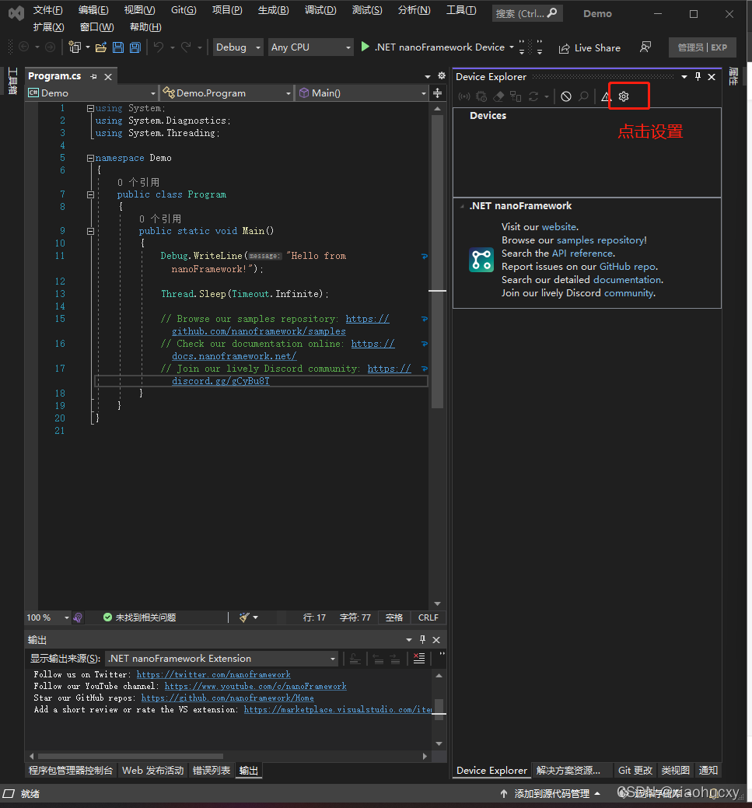

# .NET nanoFramework 安装教程

## 准备材料

esp32单片机（支持wifi蓝牙） 安卓数据线（需要支持传输）


### 注意！请先安装esp32驱动程序

[ESP32驱动链接]('https://pan.baidu.com/s/1V90LMRk13ZaUMJxM2teXbw')

提取码：ztip
复制一下GitHub镜像 nanoframework/nf-interpreter: nanoFramework Interpreter, CLR, HAL, PAL and reference target boards (github.com) https://github.com/nanoframework/nf-interpreter

### 安装 .NET nanoFramework固件闪存

```shell
dotnet tool install -g nanoff
```

成功安装后，将显示一条消息，显示用于调用该工具的命令以及安装的版本。类似于以下示例：

```shell
You can invoke the tool using the following command: nanoff
Tool 'nanoff' (version '9.9.9') was successfully installed.
```

安装路径问题

⚠️当安装在包含变音符号的路径中时，运行STM32设备命令的已知问题。这是由 STM32 多维数据集编程器中的一个已知错误引起的。例如，如果您的用户路径是这种情况，则必须将其安装在具有这些路径的位置。若要实现此目的，请使用以下 .NET Core CLI 命令，该命令指定了将安装该工具的路径：nanoff

```shell
dotnet tool install nanoff --tool-path c:\a-plain-simple-path-to-install-the-tool
```

请注意，如果您不与 STM32 设备一起使用，则此限制不适用。

## 然后准备vs code, 和vs2022,本文将用vs2022做教程

准备好以后将esp32设备和电脑连接（安卓线连接）

开始搭建esp32的nanoframework 开发环境

打开vs code然后点击扩展


### 搜索 nanoframework 然后安装


### 安装完成以后；打开vs2022,点击继续但无需代码



### 点击管理扩展


### 搜索并安装nanoframework扩展，安装完成以后关闭整个vs2022


### 关闭vs2022以后后弹出这个安装扩展的界面点击安装


### 漫长的等待安装


### 安装完成重新打开vs2022


### 然后点击创建新项目


### 搜索nanoframework，然后点击第一个然后点击下一步


### 创建项目Demo示例点击创建


### 依次点击视图=》其他窗口=》Device Explorer


### 点击设置



### 全部点击两边全部点击（COM port black list:表示屏蔽COM）


### 然后关闭设置；我们在来到vs code中找到刚刚vs2022创建的项目路径 并打开


### 安装nanoframework的vscode扩展


按住ctrl+shift+p ；然后搜索nanoframework 点击nanoframework flash device

等待一小会就会弹框


安装自己的esp32安装我安装是红色框框的


### 固件烧录完成


然后打开vs2022这个时候我们就可以看到设备了然后点击运行


### 好了运行完成 


有喜欢c#单片机研究的朋友可以加我的q：239573049
