# .NET nanoFramework 实现编写esp32单片机获取DHT11温度传感器参数

欢迎爱好c#的爱好者，本文章我们将用C#的nanoframework框架来编写获取esp32单片机上的DHT11传感器的温度和湿度

实现我们需要准备配置好esp32的环境可以看看之前写的esp32搭建 [如何使用c#编写单片机程序](./nanoInstall)

然后购买DHT11一个（某宝）几块钱的如图

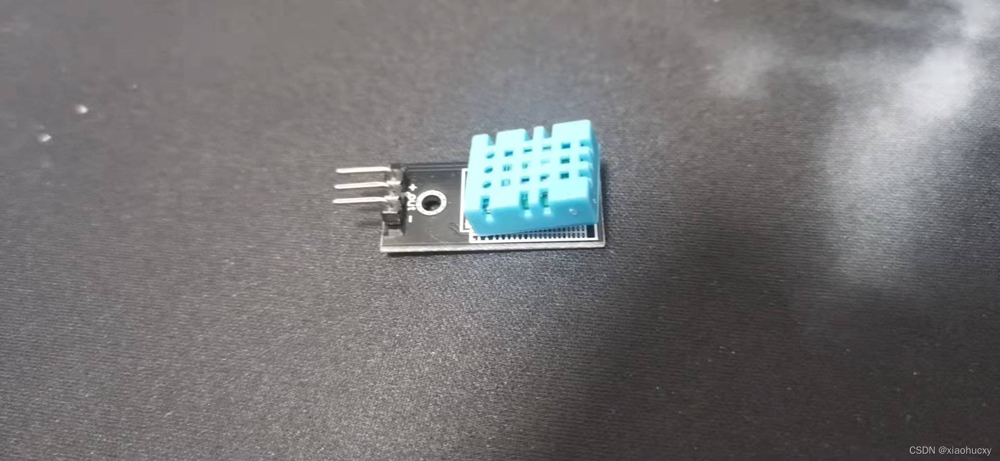
然后我们就可以开始开发了。

## 第一步创建nanoframework项目Demo

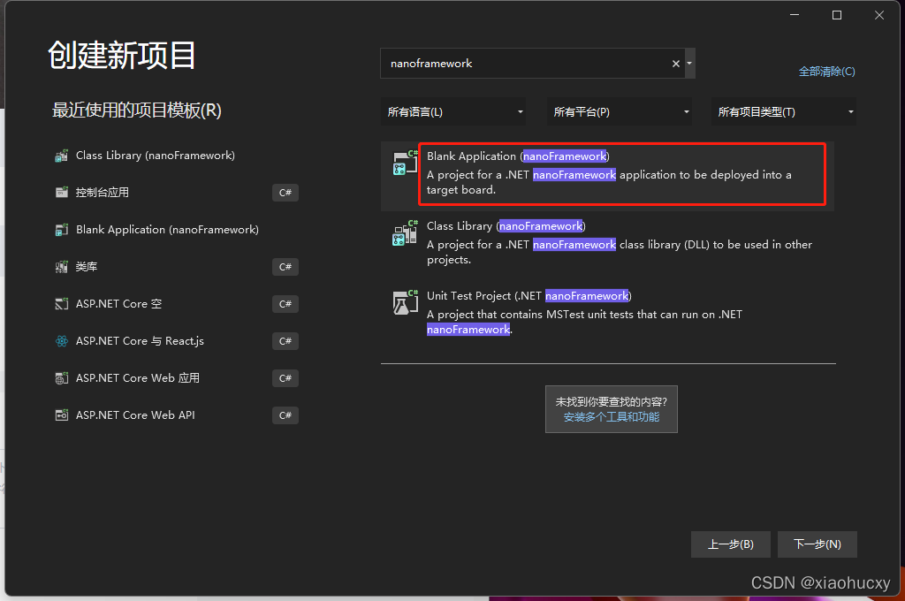
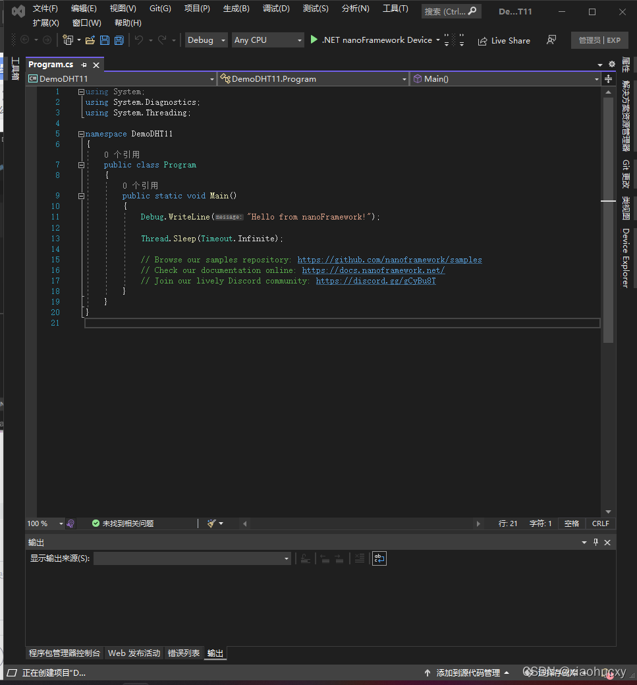

点击NuGet

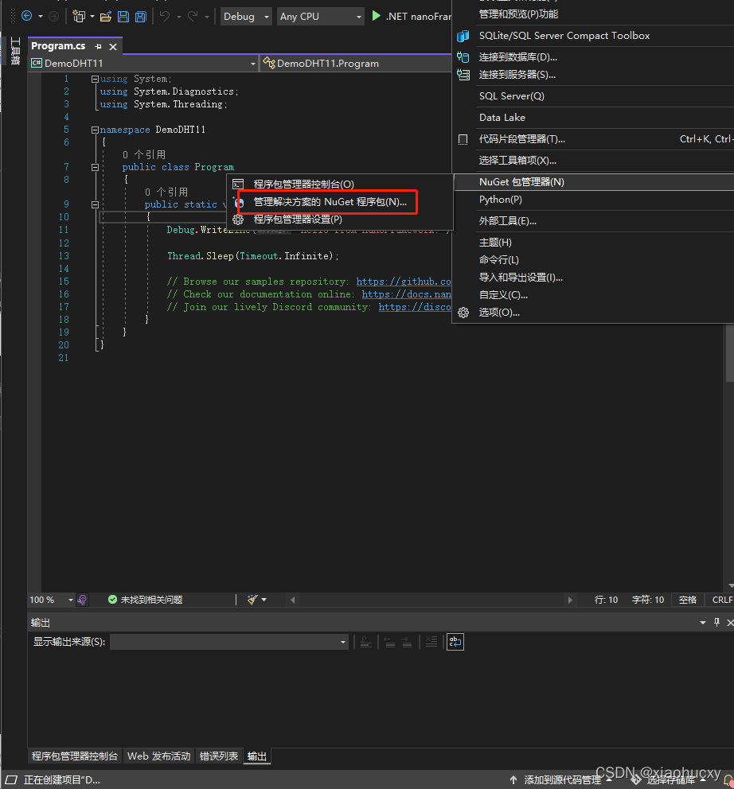

### 搜索 nanoFramework.Iot.Device.Dhtxx.Esp32 并且安装到项目中


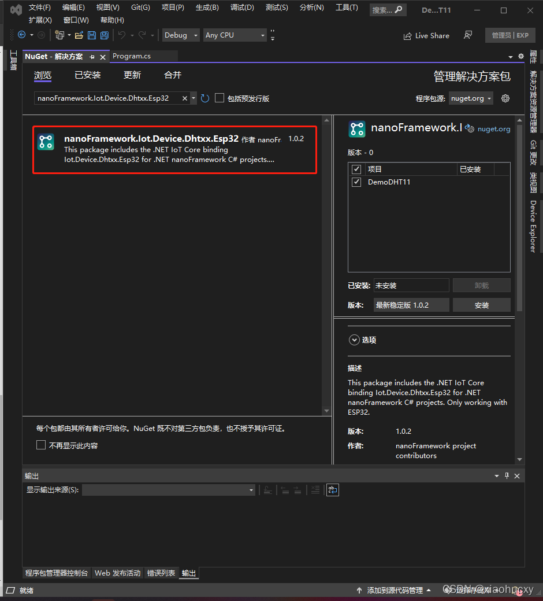
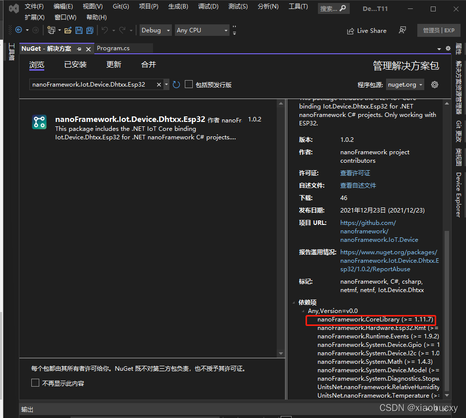
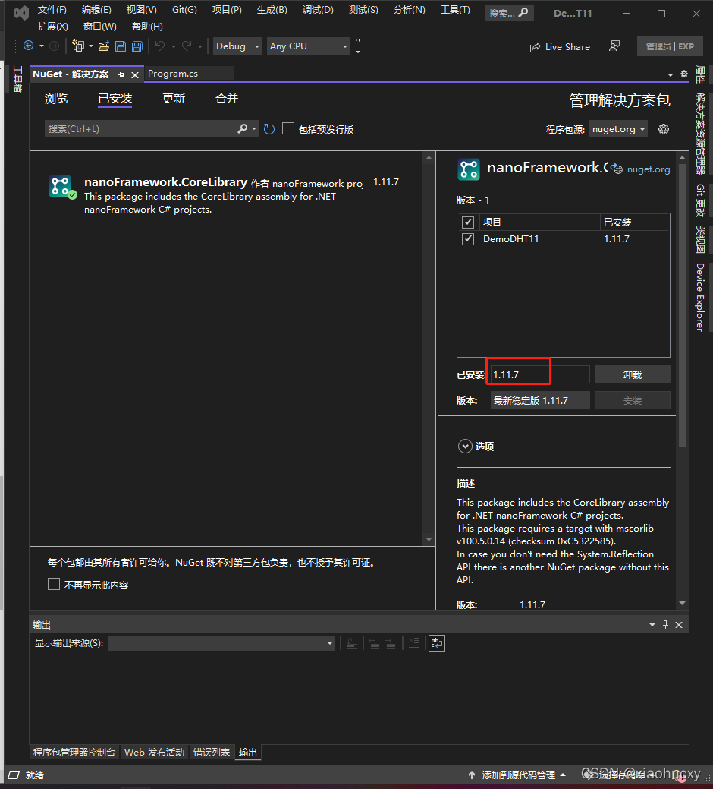

### 安装的nanoFramework.Iot.Device.Dhtxx.Esp32的依赖nanoFramework.CoreLibrary版本需要一致必须一致复制一下代码块

```csharp
using Iot.Device.DHTxx.Esp32;
using System.Diagnostics;
​
namespace DemoDHT11
{
    public class Program
    {
        public static void Main()
        {
            //12，24 代表针角
            using (Dht11 dht = new Dht11(12, 14))
            {
                var temperature = dht.Temperature;//获取温度
                var humidity = dht.Humidity;//获取湿度百分比
                if (dht.IsLastReadSuccessful)//是否获取成功
                {
                    Debug.WriteLine($"温度: {temperature.DegreesCelsius} \u00B0C, 湿度百分比: {humidity.Percent} %");
                }
                else
                {
                    Debug.WriteLine("读取DHT传感器错误");
                }
            }
        }
    }
}
```

接好排线如图所示：12和14是out（data）外接出俩条线

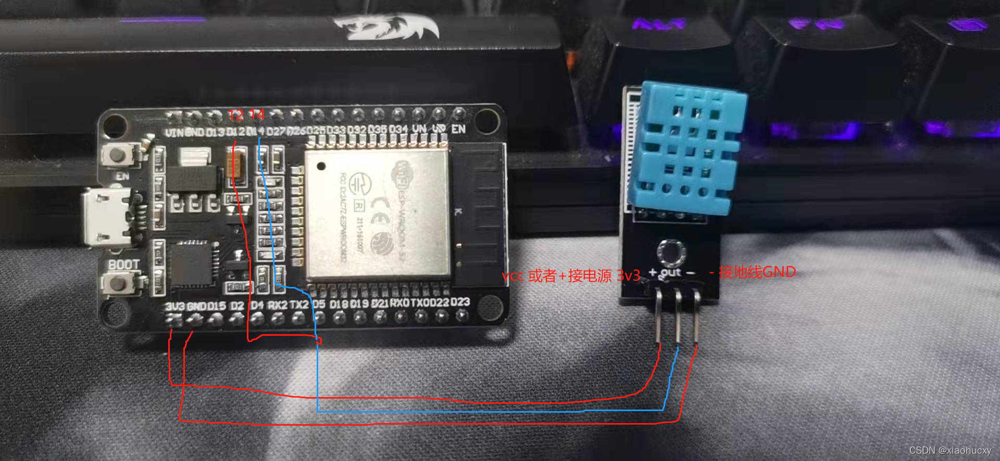
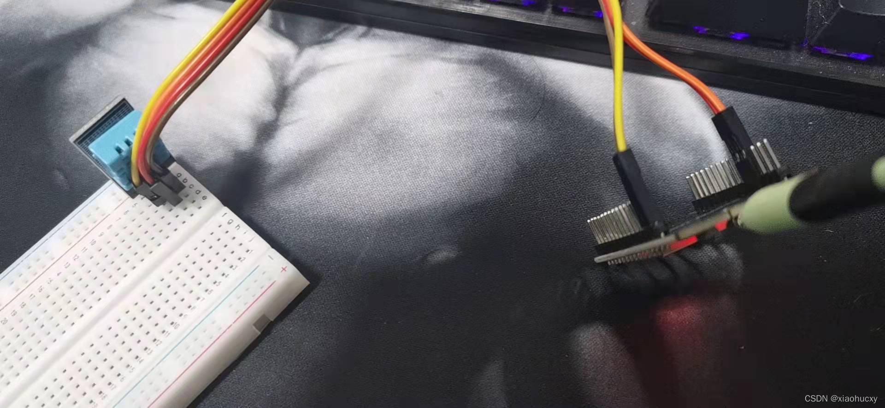

选择设备并且运行程序

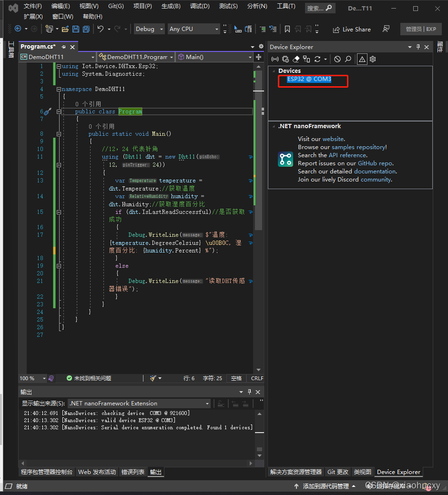

运行结果:温度: 20.8 °C, 湿度百分比: 64 %

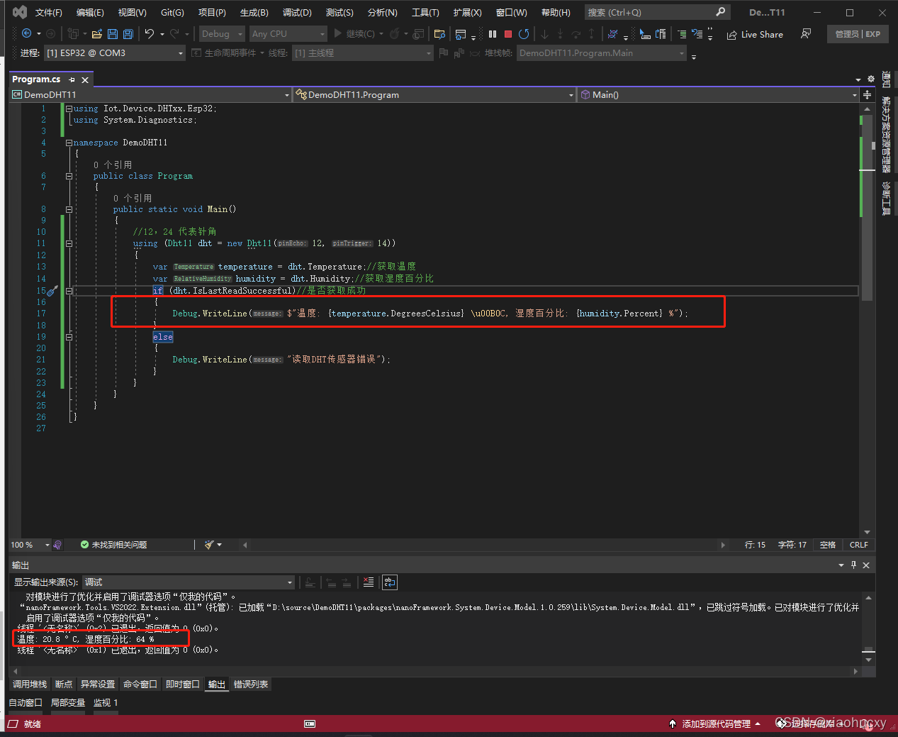

谢谢喜欢c#编程的xd我希望越来越多的人喜欢c#甚至喜欢用c#写单片机编程
